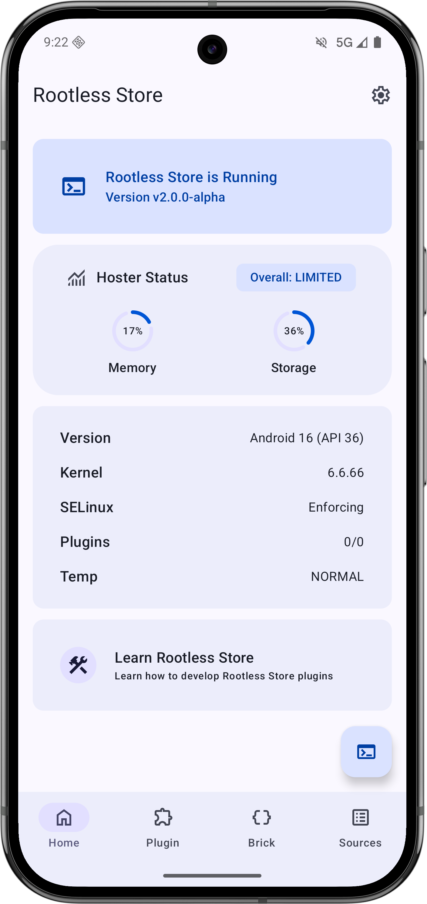
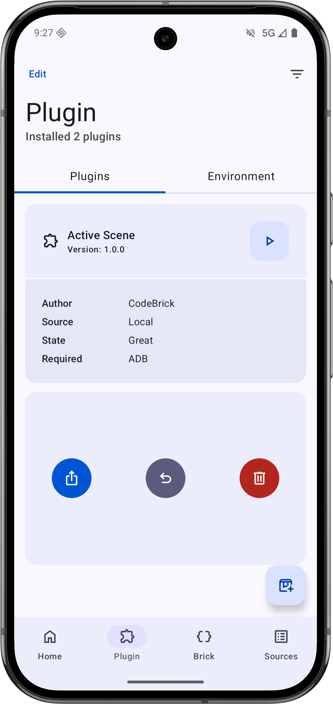
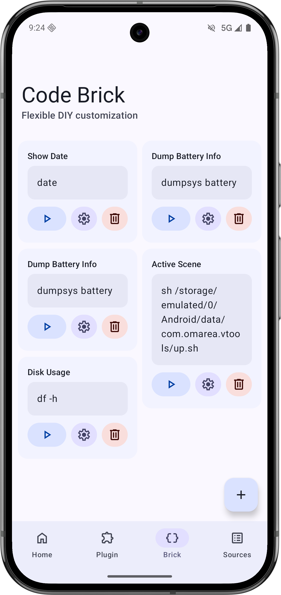
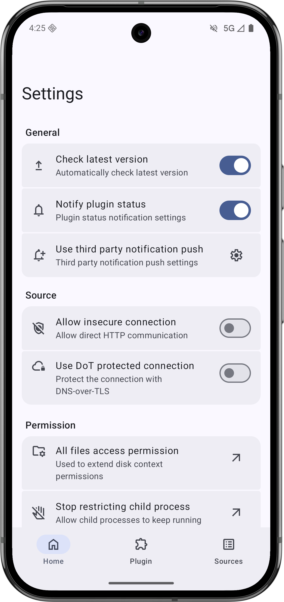
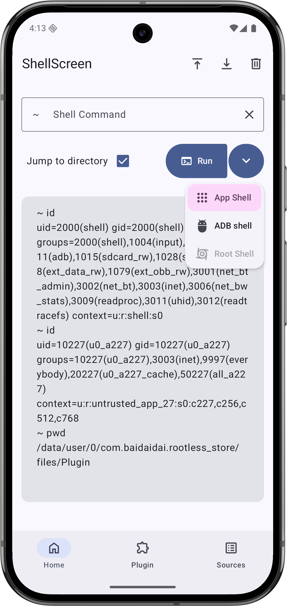

</img>

<h1 style="width: 100%; display: flex; justify-content: center; align-items: center;">Rootless Store</h1>

    <a href="/asset/markdown/readme/README_zh-CN.md">本文中文版</a>
    
·

    <a href="https://resilien-mobile.github.io/RootlessStore_WiKi/">Official Wiki</a>

<h4 style="width: 100%; display: flex; justify-content: center; align-items: center; margin-bottom: 30px">An open-source, rootless plugin management and runtime platform for the Android ecosystem</h4>

    
    
    
    
    
    

## Overview

Rootless Store is not just a tool for installing plugins.  
It aims to fill a long-missing gap in the Android ecosystem:

- making plugins discoverable, manageable, and executable
- making Sources organized, traceable, and maintainable
- allowing more users to access Android and Linux-like capabilities with a lower barrier to entry

It stands on three core principles:

- **Rootless / Low Barrier**
- **Open Source / Maintainable**
- **Decentralized / Extensible**

## Features

- Manage, execute, share, and install plugins from configurable sources
- Build quick automations with CodeBrick, then promote them into full plugins when they grow
- Run both one-shot scripts and daemon-style plugins designed for long-running workflows
- Choose the right execution context: limited app shell, Shizuku / ADB, or Root
- Receive remote notifications for plugin status changes and warning events
- Monitor device status, including Memory, Storage, Kernel, SELinux, Plugin state, and temperature
- Use a GUI-first workflow instead of wrestling with traditional TUI / TTY tooling

## Roadmap

- [x] Complete the core pages and documentation structure
- [x] Establish the basic interfaces for Source and Market
- [x] Build the initial runtime plugin development documentation
- [x] Improve the Market and plugin detail UI
- [x] Support for plugin kill notification
- [x] Third-party Notification Pushing
- [x] More personalized plugins
- [x] Daemon fully supports
- [x] Plugin status transition cleaning
- [x] Support Preference Panel
- [x] Support private sources, invisible sources, and paid sources
- [x] Shell code snippet support
- [ ] Base64 CodeBrick Token support
- [x] Magisk Plugin Compatibility Layer
- [x] Quick launch tile of the Android Control Center
- [x] Host status panel， More Expressive
- [x] Add test matrix (not yet completed)
- [x] More objective error cause
- [ ] Certificate signature tamper-proof verification chain
- [ ] A more intuitive demonstration of plugin execution methods
- [ ] Improve filtering, state feedback, and permission boundaries
- [ ] Publish to F-Droid

## Why I Built Rootless Store

Because I have always believed that the Android ecosystem does not lack capability.  
What it lacks is a proper entry point that can bring people together.

Shizuku, Magisk, KernelSU, ADB, Shell, Root...  
These tools are powerful, but they have long remained trapped in fragmented information, scattered scripts, and high-barrier command-line workflows.  
There are many capable people, but very few ecosystems that are truly approachable.

That is why Rootless Store exists.  
It is meant to reorganize these capabilities.  
Not to turn technology into a black box,  
but to return understanding and access to more people.

## My Belief

I have always believed in one sentence:

> **Truth will eventually tear through lies, and technology should belong to everyone.**

From Animora to Rootless Store,  
what I truly want to build is not just “more features,” but:

- clearer code
- friendlier documentation
- capabilities that do not belong only to a few
- an open-source reality that people can actually participate in

## What Rootless Store Wants to Say

- The Android ecosystem deserves its own plugin infrastructure
- Technology should not remain in the hands of only a few people
- Open source is not only about exposing code, but also about exposing understanding
- Capability should not become a barrier; it should become a bridge

## Final Words

What Rootless Store wants to do is simple:

**to place the final missing piece into the Android ecosystem.**

Not to create new barriers,  
but to reorganize the capabilities that already exist  
in a clearer, more open, and more approachable way.

---

### For those
**who still believe in openness, still dare to explore, and still choose hope**
